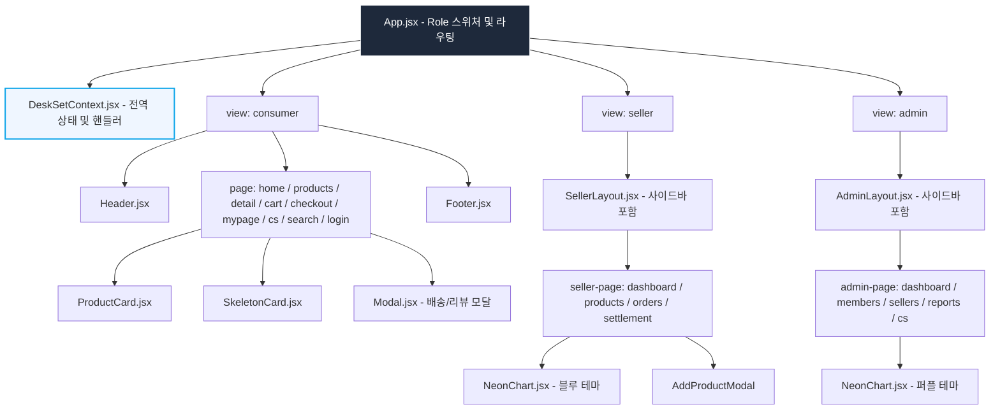

# ⚛️ DeskSet 쇼핑몰 웹앱 리액트(React) 전환 작업 계획서

기존에 퍼블리싱된 HTML, CSS, Vanilla JS 리소스를 분석하여, 유지보수성과 확장성이 뛰어난 모던 **React + Vite** 프로젝트로 마이그레이션하기 위한 마스터 플랜 및 기술 설계도입니다.

---

## 1. 프로젝트 개요

* **목표**: 3대 역할군(소비자, 입점사, 관리자)의 통합 이커머스 웹앱인 **DeskSet**을 React 컴포넌트 기반 아키텍처로 변환하여 코드 재사용성을 높이고 비즈니스 로직과 UI 렌더링을 완전히 분리합니다.
* **프로젝트 경로**: `D:\KJH\html\shop`
* **변환 핵심 포인트**:
  1. 역할 스위칭 및 화면 라우팅의 리액트 상태화 (`useState`, `useContext` 기반 라우팅)
  2. 전역 상태 공유 모델 구축 (상품 인벤토리, 장바구니, 주문, 문의 상태 동기화)
  3. UI 재사용성 증대 (공통 헤더/푸터, 상품 카드, 공통 모달, 토스트 알림 컴포넌트화)
  4. 성능 최적화 (차트 렌더링 클린업, 불필요한 리렌더링 차단)

---

## 2. 기술 스택 (Tech Stack)

* **빌드 도구 (Build Tool)**: **Vite** (빠른 HMR 및 초경량 빌드 환경 제공)
* **프레임워크 (Framework)**: **React 18** (Functional Component + Hooks)
* **스타일링 (Styling)**: **Vanilla CSS** (기존 스타일시트를 재가공하여 Global CSS와 CSS Modules 혼용)
* **전역 상태 관리 (State Management)**: **React Context API** (별도의 복잡한 외부 라이브러리 없이 요구사항에 충분한 상태 무결성 지원)
* **아이콘 라이브러리 (Icons)**: **Lucide React** (기존 inline SVG를 대체하여 코드 가독성 증폭) 혹은 인라인 SVG형 컴포넌트화
* **기타 유틸리티**: **Canvas API** (판매자/어드민 네온 대시보드 차트)

---

## 3. 권장 디렉토리 구조 (Directory Structure)

리액트 마이그레이션 이후 유지보수를 극대화하기 위한 모듈식 아키텍처 권장 폴더 트리입니다.

```text
src/
├── assets/                  # 이미지, 로고 등 정적 리소스
├── styles/
│   ├── global.css           # 기존 styles.css의 공통/리셋 스타일 이식
│   └── theme.css            # 미니멀 & 테크 테마 변수 정의
├── context/
│   └── DeskSetContext.jsx   # 전역 상태(Products, Cart, Orders, CS) 관리 및 API
├── components/              # 공통 재사용 컴포넌트
│   ├── common/
│   │   ├── Header.jsx       # 소비자 헤더
│   │   ├── Footer.jsx       # 소비자 푸터
│   │   ├── Toast.jsx        # 알림 메시지 토스트
│   │   └── Modal.jsx        # 배송조회/리뷰작성용 공통 모달
│   └── ui/
│       ├── ProductCard.jsx  # 상품 그리드 카드
│       ├── SkeletonCard.jsx # 스켈레톤 로더
│       └── NeonChart.jsx    # Canvas 기반 매출 통계 차트 (재사용 가능형)
├── views/                   # 역할군별 레이아웃 및 뷰
│   ├── Consumer/            # 소비자 영역
│   │   ├── HomeView.jsx
│   │   ├── ProductsView.jsx
│   │   ├── ProductDetailView.jsx
│   │   ├── CartView.jsx
│   │   ├── CheckoutView.jsx
│   │   ├── MyPageView.jsx
│   │   ├── SearchView.jsx
│   │   └── CustomerServiceView.jsx
│   ├── Seller/              # 입점사 영역
│   │   ├── SellerLayout.jsx # 사이드바 레이아웃
│   │   ├── SellerDashboard.jsx
│   │   ├── SellerProducts.jsx
│   │   └── SellerOrders.jsx
│   └── Admin/               # 관리자 영역
│       ├── AdminLayout.jsx  # 관리자 전용 레이아웃
│       ├── AdminDashboard.jsx
│       ├── AdminMembers.jsx
│       ├── AdminSellers.jsx
│       ├── AdminReports.jsx
│       └── AdminCs.jsx
├── App.jsx                  # 역할 스위칭 및 메인 컨트롤러
└── main.jsx                 # 엔트리 포인트
```

---

## 4. 컴포넌트 구조도 (Component Tree)



---

## 5. 단계별 마이그레이션 로드맵 (Roadmap)

```mermaid
gantt
    title DeskSet React 마이그레이션 일정 계획
    dateFormat  YYYY-MM-DD
    section 인프라 & 상태
    1단계: Vite 리액트 환경 구성           :active, des1, 2026-05-27, 1d
    2단계: 스타일이식 & 글로벌 테마 정의     :active, des2, after des1, 1d
    3단계: Context API 기반 전역 상태 설계  : des3, after des2, 2d
    section 컴포넌트 개발
    4단계: 공통 UI 개발 (Toast, 카드 등)    : des4, after des3, 2d
    5단계: 소비자(Consumer) 뷰 포팅        : des5, after des4, 4d
    6단계: 입점사 대시보드 & Canvas 차트    : des6, after des5, 3d
    7단계: 관리자(Admin) 모니터링 모듈화     : des7, after des6, 2d
    section 최적화 & 테스트
    8단계: E2E 디버깅 및 프로덕션 빌드      : des8, after des7, 2d
```

### [1단계] 개발 환경 구축 (Vite + React)
1. D:\KJH\html\shop 경로에서 Vite 템플릿 생성:
   ```bash
   npx create-vite@latest ./ --template react
   ```
2. 패키지 설치 및 구동 확인 (`npm install`, `npm run dev`)

### [2단계] 글로벌 테마 & CSS 이식
1. 기존 `styles.css`에서 Reset, Base 및 전역 스타일(Role Switcher 등)을 추출하여 `src/styles/global.css`로 마이그레이션합니다.
2. 메인 테마 컬러 및 다크 모드 속성들을 CSS 변수화(`:root` 정의)하여 정돈합니다.
   * `--color-primary`: `#1E293B`
   * `--color-secondary`: `#0EA5E9`
   * `--color-bg`: `#F8FAFC`

### [3단계] `DeskSetContext.jsx` 전역 상태 설계
1. 기존 `app.js`에 산재되어 있던 Mock Data(초기 상품, 장바구니, 주문 내역, CS 공지)를 Context의 초기 상태(`initialState`)로 이식합니다.
2. 핵심 상태 조작 핸들러 함수들을 정의하고 리액트 상태화합니다.
   * `addToCart(productId, qty, color, size)`
   * `deleteSelectedCartItems()`
   * `simulatePayment(shippingInfo)`: 외부 TossPay 결제 시뮬레이션 동작
   * `updateShippingStatus(orderId, status, courier, trackingNo)`
   * `addNewProduct(productData)`: 입점사 신규 상품 판매 등록
   * `toggleBlindReview(reviewId)`: 어드민 블라인드 차단 처리
   * `answer1to1Inquiry(inquiryId, replyText)`: 어드민 문의 답변 처리

### [4단계] 공통 컴포넌트 구축
1. **Header / Footer**: 소비자용 헤더 내비게이션 및 장바구니 배지 실시간 갱신 컴포넌트화.
2. **ProductCard**: hover 애니메이션, 세일 배지, 별점 출력을 포함한 독립 컴포넌트화.
3. **Toast**: 전역 알림용 플로팅 컴포넌트 구현.
4. **Modal**: Modal 백드롭 디미 현상 및 스크롤 고정 등을 React Portal을 활용하여 깔끔하게 모듈화.

### [5단계] 소비자(Consumer) 뷰 포팅
1. **HomeView**: 메인 히어로 배너, 카테고리 카드 리스트, 추천 인기 상품 연동.
2. **ProductsView**: 카테고리 탭 스위처, 조건 정렬 드롭다운, 스켈레톤 홀더 연동.
3. **ProductDetailView**: 3단 탭 인터페이스(상세설명/리뷰/Q&A), 서브 썸네일 갤러리 연동.
4. **CartView & CheckoutView**: 체크박스 선택 연동, TossPay 로딩 시뮬레이터 적용.
5. **MyPageView**: 배송 진행 바 실시간 동기화, 배송조회/리뷰작성 모달 바인딩.

### [6단계] 입점사(Seller) 기능 루프 & Canvas 최적화
1. **useEffect 활용 Canvas Chart**:
   * Canvas 인스턴스를 관리하기 위해 `useRef`를 도입하고, 컴포넌트 마운트 시 네온 블루 차트를 렌더링하도록 `useEffect` 최적화.
   * 컴포넌트 언마운트 시 메모리 누수가 발생하지 않도록 리사이즈 이벤트 등 클린업 코드를 명확히 구현합니다.
2. **상품 및 주문 관리 테이블**: 정산 신청, 운송장 일괄 지정, 신규 상품 가입 인풋 실시간 반영.

### [7단계] 관리자(Admin) 권한 포팅
1. **어드민 모니터링**: 퍼플 테마 매출 Canvas 차트 로딩 및 4대 KPI 수치 동기화.
2. **신고 & CS 어드민**: 블라인드 상태 즉시 제어, FAQ 등록/수정/삭제 CRUD 구현.

---

## 6. 마이그레이션 시 주의 사항 & 최적화 가이드

> [!WARNING]
> **1. Canvas Context 메모리 누수 방지**
> 입점사/어드민 대시보드의 매출 추이 차트는 HTML Canvas API를 사용하므로 리액트 리렌더링 시 지속해서 컨텍스트가 초기화되거나 리사이즈 이벤트 핸들러가 누적될 위험이 큽니다. 반드시 `useEffect` 내부에서 리스너 클린업 함수(`return () => window.removeEventListener(...)`)를 작성해야 합니다.

> [!TIP]
> **2. React Portals의 도입**
> 배송 추적, 리뷰 작성, 상품 등록 모달 등 여러 모달창이 깊은 컴포넌트 트리에 중첩될 경우, CSS `z-index`나 `position` 속성이 꼬여 어색하게 배치될 수 있습니다. `createPortal`을 활용하여 모달들을 HTML `body` 최하단에 다이렉트 렌더링되게 설계하면 시각적 버그를 완벽히 격리할 수 있습니다.

> [!IMPORTANT]
> **3. 불필요한 리렌더링 최소화**
> 상품 검색 필터링(`filterSearch`) 시 글자가 타이핑될 때마다 최상위 Context 전체가 리렌더링되는 비효율을 제어해야 합니다. 검색 입력 필드는 로컬 컴포넌트 상태로 분리하거나 `useMemo`를 사용해 필터링 결과를 캐싱해야 성능 지연을 원천 차단할 수 있습니다.
